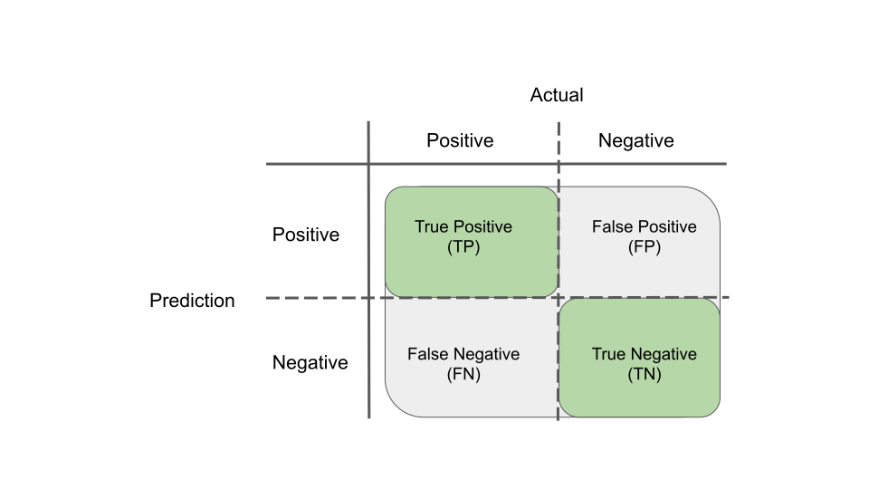
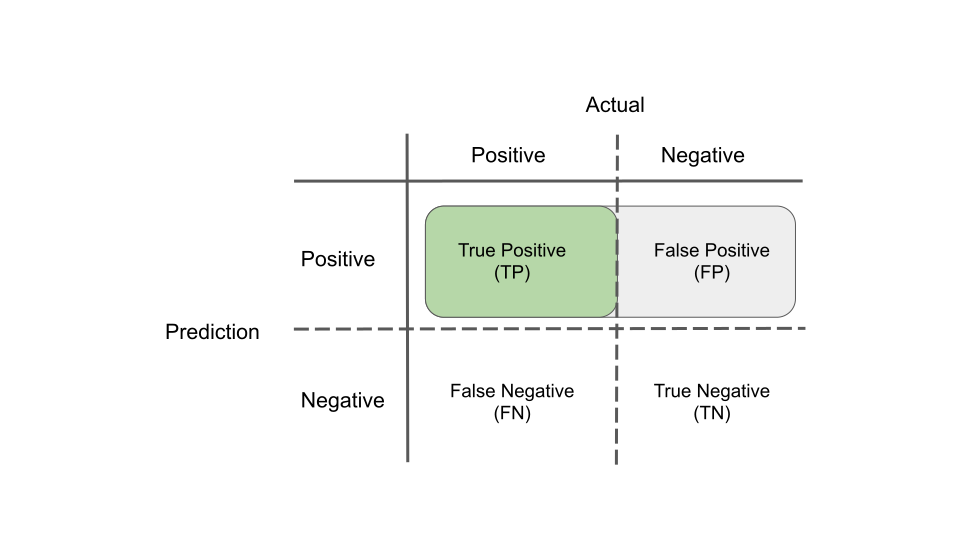
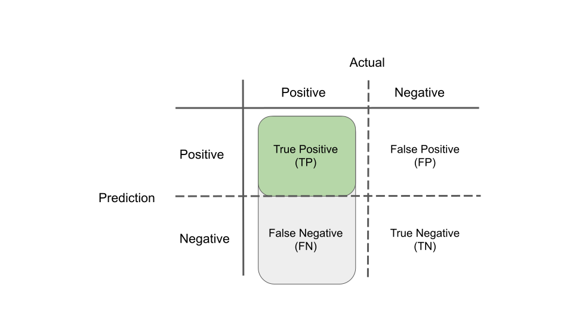
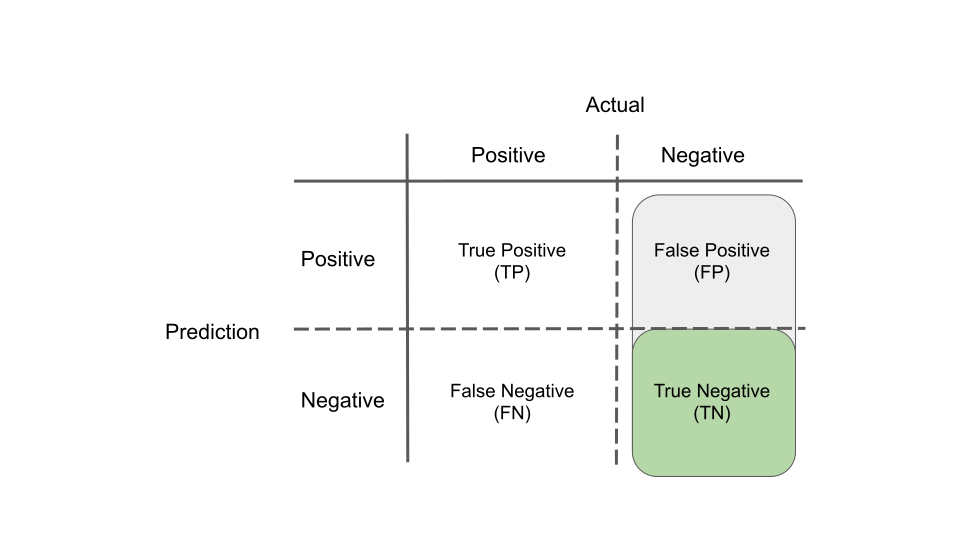
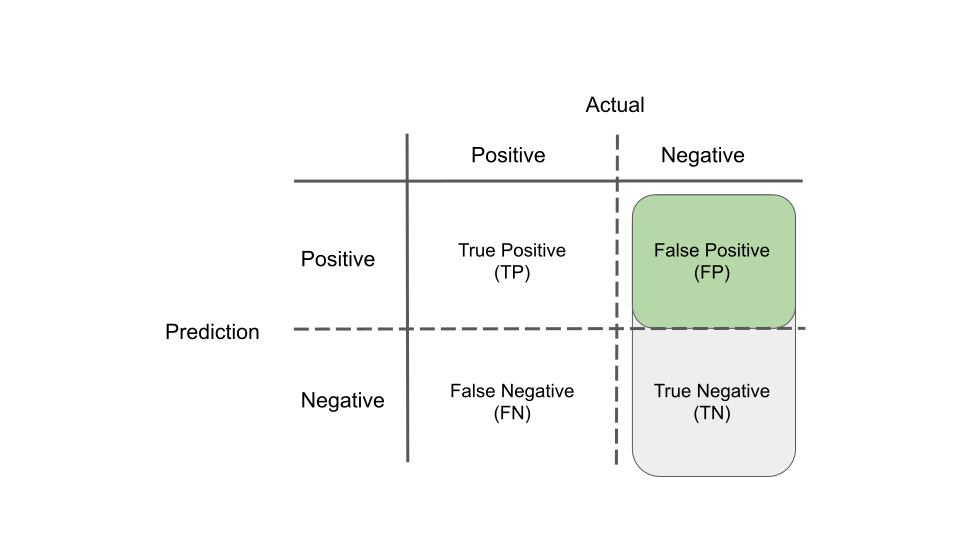
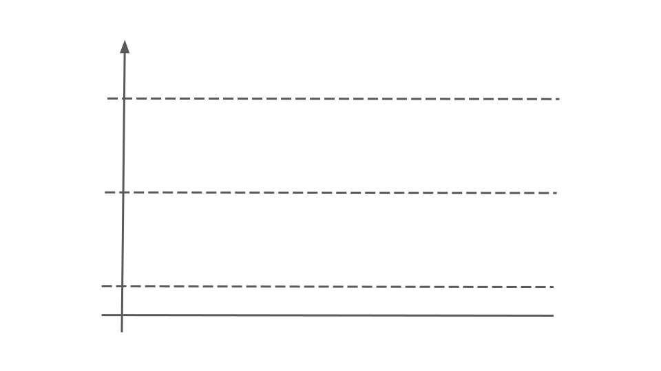
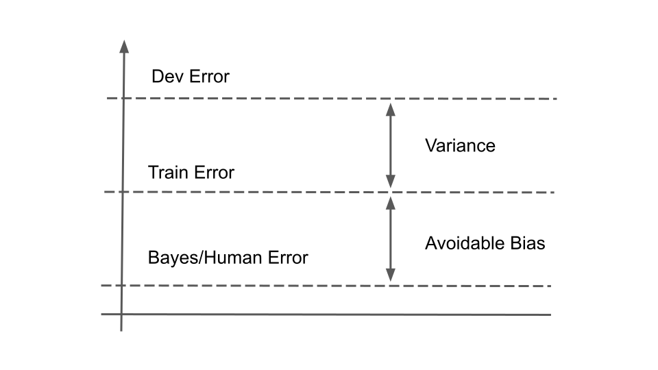

# Machine Learning

### How can you reduce overfitting? {-}

- Collect more data to train with
- Use data augmentation to generate more train data
- Use cross-validation to better estimate your error during model selection
- Reduce the complexity of the model by reducing the number of parameters/layers
- Use a different model/architecture that generalises better
- Use a regularisation technique (L1/L2 regularisation, dropout)
- Use early stopping during training
- Filter out irrelevant or redundant features using a feature selection technique
- Use Ensembling to combine predictions from multiple models

### Define accuracy, precision, recall, specificity, false positive rate {-}

#### Accuracy {-}

$$
  \text{Accuracy} = \frac{TP + TN}{TP + FP + FN + TN}
$$

```{r accuracy-definition-diagram, echo=FALSE, fig.align="center", out.width = "80%"}

```

#### Precision {-}

$$
  \text{Precision} = \frac{TP}{TP + FP}
$$

```{r precision-definition-diagram, echo=FALSE, fig.align="center", out.width = "80%"}

```

#### Recall (sensitivity, true positive rate) {-}

$$
  \text{Recall} = \frac{TP}{TP + FN}
$$

```{r recall-definition-diagram, echo=FALSE, fig.align="center", out.width = "80%"}

```

#### Specificity (selectivitiy, true negative rate) {-}

$$
  \text{Specificity} = \frac{TN}{FP + TN}
$$

```{r specificity-definition-diagram, echo=FALSE, fig.align="center", out.width = "80%"}

```

#### False positive rate {-}

$$
  \text{False positive rate} = \frac{FP}{FP + TN}
$$

```{r false-positive-rate-definition-diagram, echo=FALSE, fig.align="center", out.width = "80%"}

```

### Define F1 score {-}

The F1 score is defined as

$$
  F_1 = 2 \frac{\text{precision} \cdot \text{recall}}{\text{precision} + \text{recall}}
$$
Alternative ways to memorise this formula

$$
  F_1 = \frac{2}{\frac{1}{\text{precision}} + \frac{1}{\text{recall}}}
$$
or

$$
  F_1 =  \frac{\text{precision} \cdot \text{recall}}{\frac{\text{precision} + \text{recall}}{2}}
$$

In terms of true/false positives/negatives it is defined as

$$
  F_1 =  \frac{TP}{TP + \frac{FP + FN}{2}}
$$

### What are training, validation (development) and test sets? {-}

**Train (training) set** is a set of examples on which the model is trained.

**Validation set** or **dev (development) set** is a set of examples used for model selection and hyperparameter tuning. This is independent of the training set but it should come from the same distribution. The examples in this set are different from the ones seen by the models during training. Different trained models are all evaluated on the validation/dev set and the best performing model is chosen.

**Test set** is a set of examples that are used to assess the performance of the very final model on examples that have not used before either during training or model selection/hyperparameter tuning.

### What is the right split for train/dev/test sets? {-}

- For smaller datasets of up to 10K examples, the split is classically **60% (train) - 20% (dev) - 20% (test)**.
- For big datasets that typically contain millions of examples (used in training complex deep learning models), one can afford to do a split of **98% (train) - 1% (dev) - 1% (test)**. This maximises the amount of data needed for training the complex models, while still setting asside at least 10K of examples for each of the dev and test sets. 

### Define loss, cost and objective functions {-}

- Loss function is a function defined on a single example producing a single penalty term. It is a measure of error that tells us how good the prediction is compared to the actual label of the example.

- Cost function is evaluated on all the examples in a specific set (e.g. the train set for train error, the test set for test error, a mini-batch in mini-batch gradient descent), and it is typically a sum (or average) of the loss function over all examples. It might include additional penalty terms like regularisation terms. The ultimate goal of training a model is to minimise the cost function.

- Objective function is a function that measures the quality of a solution to a problem. One searches for optimal solutions to the problem by optimising the objective function, i.e. finding the parameters of the solution/model that minimise or maximise (depending on the problem) the objective function. The cost function is an example of an objective function.

### How batch, minibatch and stochastic gradient descent differ? {-}

For all algorithms, at each step the parameters of the model are updated based on the gradient of the cost function with respect to the parameters.

- In (batch) gradient descent, the gradient used in each step is the gradient of the whole cost function which contains the loss function for all examples. Therefore, we need to make a pass (called training epoch) over the whole dataset before each step is taken.
- In stochastic gradient descent, the gradient used in each step is the gradient for a randomly chosen example. The examples are shuffled and then iterated over. Several passes are made over the examples until the algorithm converges to a minimum of the cost function.
- In minibatch gradient descent, the data are split into mini-batches of size $n$. The gradient at each step is calculated for a mini-batch of n examples. All examples are iterated over in mini-batches. For $n=1$ we get stochastic gradient descent. For $n$ equal to the total number of examples we get batch gradient descent.

### Place bayes/human error, training error and dev error on this graph. Define avoidable bias and variance on the same graph. {-}

```{r avoidable-bias-variance-definition-empty-graph, echo=FALSE, fig.align="center", out.width = "70%"}

```

Due to some degree of overfitting the train error is usually lower than the dev error. Assuming that for the specific domain the human error is a good proxy for the Bayes error, then this will be the lowest error possible and therefore the train error would be higher than that.


```{r avoidable-bias-variance-definition, echo=FALSE, fig.align="center", out.width = "70%"}

```

Avoidable bias is the difference between the human error and the train error. Variance is the difference between the train error and the dev error.

### Will you focus on reducing bias or variance in a neural network in the following cases and how?  {-}

|               |   Case 1   |  Case 2 |
| ------------- |:----------:|:-------:|
| Human error   |     2%     |   9.5%  |
| Train error   |    10%     |    10%  |
| Dev error     |    12%     |    12%  |

In case 1, the focus should be on reducing the bias. This can be achieved by

- training the network for longer,
- using a better optimisation algorithm (for example RMSprop or Adam),
- using a bigger network (more nodes per layer, more layers),
- changing to a different architecture that is better suited to the task.

In case 2, the focus should be on reducing the variance. This can be achieved by

- training with more data (either by collecting them, or by using data augmentation),
- using a regularisation techinque (for example dropout layers),
- changing to a different architecture that is better suited to the task.

### What is vectorization of an algorithm and what are its benefits {-}

Vectorization is the process of removing explicit _for loops_ in order to make an algorithm run more efficiently. This is achieved by

- grouping relevant variables and representing them with a single matrix
- rewriting the steps of the algorithm as expressions of these matrices with matrix operations among them
- implementing these steps/expressions using a library that has vectorized implementations for the matrix operations (for example NumPy).

For example, in the formula below, we have a set of weights $w_i$, features $x_i$ and a bias $b$, and in order to calculate the output $z$ we could do an explicit for loop in code for each value of $i$

$$
  z = \sum_{i=1}^{n} w_i x_i + b.
$$

In a vectorized version of this calculation, we group the weights in a column vector $W$ and the features in a column vector $X$ and the sum term can be replaced by the matrix multiplication of the transpose of the weights $W^T$ with the $X$

$$
  z = W^T X + b.
$$

Taking this to the next level, we can group the features of all examples into a single matrix where each column contains the features of a single example. With similar matrix multiplication as above we can calculate the output for all examples in the dataset in a single statement (as a column vector $Z$), avoiding a double nested loop. In some cases for loops might be unavoidable, if one step needs the output of another step, for example as we progress from layer to layer in a deep neural network, or from epoch to epoch.

Vectorization can be utilised in various parts of an algorithm. For example, the calculation of the activations during a forward pass in a deep neural network, calculation of the cost function over the current batch of examples, and the calculation of derivatives during a backward pass.

Vectorized code runs much faster because it leverages [SIMD](https://en.wikipedia.org/wiki/SIMD) instructions to paralellise the execution of the code on CPUs and GPUs. This becomes especially critical for Big Data.

### What are the differences of image classification, object detection, semantic segmentation and instance segmentation? {-}

All these are techniques in computer vision.

- Image classification detects the presence or not of a specific class of an object in a whole picture.
It doesn't tell us in which part of the picture or how many objects are present.
- Object detection detects one or several objects in an image. It specifies the class of each object,
and in addition, it tells us where it is found on the picture by placing a bounding box around it.
- Semantic segmentation detects the object class of each individual pixel in an image. 
It produces a mask where the label of each pixel gives us the class of the object it belongs too.
This allow us to see boundaries between different types of objects, but it does not produce boundaries between
objects of the same class. For example, it tells where parked cars stop and background trees start, but
it doesn't give us boundaries between individual cars. 
- Instance segmentation works at pixel level too similarly to semantic segmentation. In addition,
it separates different instances of the same class. 
This allow us to see boundaries between different instances of objects of the same class.
For example, in the output mask pixels belonging to different cars will have different colours.For example, in the output mask pixels belonging to different cars will have different colours.

### What is the difference among normalizing, scaling and standardizing when performing feature engineering? {-}

- Normalization acts at the sample (row) level. Each sample is rescaled differently. 
The components of each sample are rescaled so that its norm equals to one. Normalisation is used in clustering for instance.
- Scaling acts at the feature (column) level. It scales the feature in the same way for all samples, 
given an algorithm that takes into account the values of the feature across all samples.
Examples of scaling include MinMax scaling (scale to a given range), Mean/variance standardization (see below) and
Robust scaling (scaling using statistics that are robust to outliers).
- Standardization is a type of scaling where we remove the mean of the feature and scale it so that its variance becomes one.

### Transform the following dataset employing one-hot encoding {-}

| sample_id | phase  | weight |
|:---------:|:------:|:------:|
|     1     | gas    |   10   |
|     2     | liquid |   20   |
|     3     | gas    |   30   |
|     4     | solid  |   10   |

We can only use one-hot encoding on the categorical (discrete) feature *phase*. We create a binary column for each of
its possible values (gas, liquid and solid). The transformed dataset is shown below.

| sample_id | phase_gas | phase_liquid | phase_solid | weight |
|:---------:|:---------:|:------------:|:-----------:|:------:|
|     1     |     1     |       0      |      0      |   10   |
|     2     |     0     |       1      |      0      |   20   |
|     3     |     1     |       0      |      0      |   30   |
|     4     |     0     |       0      |      1      |   10   |
